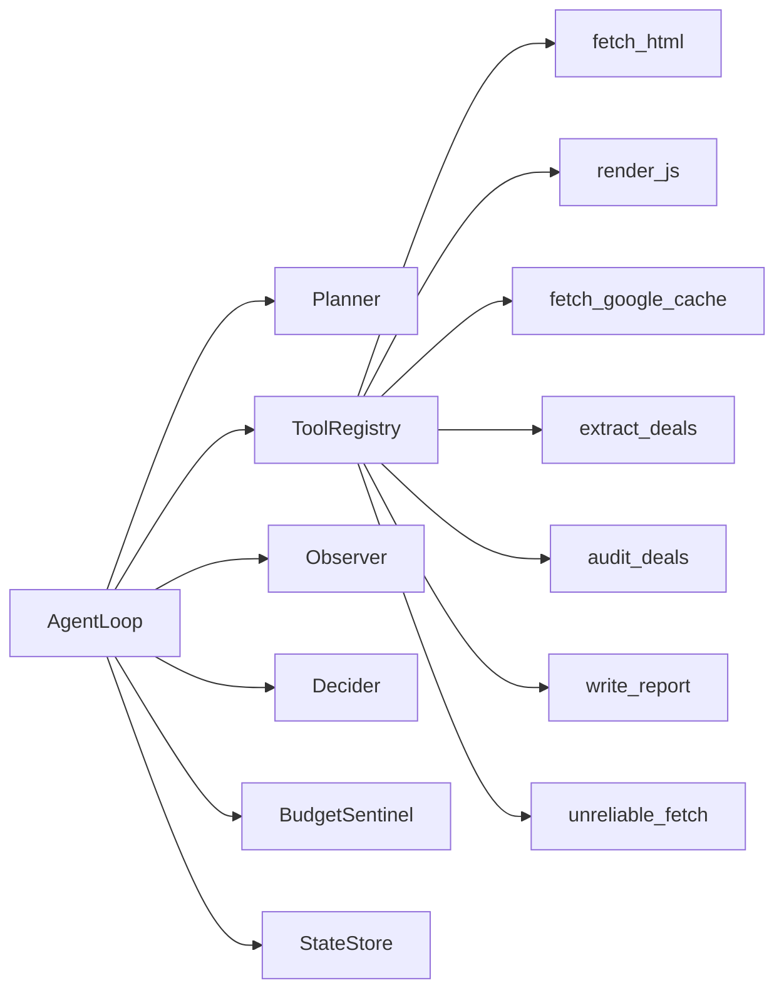

# GrabOn Merchant Deal Audit Agent

## Overview
This project implements **Assignment 02: The Loop** using the **Merchant Deal Audit Agent** track.

The agent is built around a visible single-agent control loop:
- `PLAN`
- `ACT`
- `OBSERVE`
- `DECIDE`

For each merchant, the agent decides what to do next, executes a tool, interprets the result, and either continues, retries, switches strategy, degrades gracefully, or stops. The goal is not only to scrape deals, but to demonstrate a production-style agent loop with explicit recovery, budget safety, and inspectable state.

## Why This Assignment
I chose the Merchant Deal Audit problem because it compresses the most important agent-engineering concerns into one workflow:
- multi-step planning
- tool selection
- stateful execution
- typed tool contracts
- partial failure recovery
- deterministic validation and scoring
- observability
- eval-driven verification

It is a good fit for demonstrating agent architecture rather than just writing a scraper script.

## What The Agent Does
Given 20 GrabOn merchants, the agent:
- fetches or renders a merchant deal page
- extracts current offer-like records
- compares extracted offers with a mock GrabOn database
- classifies each deal as `Fresh`, `Stale`, `Missing`, or `Updated`
- computes a deterministic merchant health score
- writes a structured merchant audit summary

The project intentionally separates:
- loop control from tool execution
- failure classification from recovery strategy
- business scoring from provider-assisted extraction/reporting

## System Architecture


## Core Design
### Explicit Loop
The central abstraction is `AgentLoop`. The loop exposes the assignment phases directly:
- `plan()`
- `act()`
- `observe()`
- `decide()`

Each iteration logs:
- step number
- phase
- action
- tool called
- observation
- decision
- tokens consumed
- wall-clock time

Primary files:
- `agent/loop.py`
- `agent/planner.py`
- `agent/observer.py`
- `agent/decider.py`

### Tool Contract
All tools are runtime-discovered through `ToolRegistry`. Every tool has:
- typed input schema
- typed output schema
- timeout
- cost annotation
- structured error response

That allows the loop to reason about tools consistently instead of relying on ad hoc exception handling.

Primary files:
- `tools/base.py`
- `tools/registry.py`
- `tools/*.py`

### State and Traceability
`StateStore` is the run-time memory layer. It preserves:
- per-merchant working state
- tool attempts
- failed tools
- next planned tool
- reasoning trace
- tool history
- token curve
- full iteration log

Primary files:
- `observability/state_store.py`
- `agent/loop.py`

## Tooling Strategy
### Tools
This repo exposes 7 custom tools:
1. `fetch_html`
2. `render_js`
3. `fetch_google_cache`
4. `extract_deals`
5. `audit_deals`
6. `write_report`
7. `unreliable_fetch`

### Why This Split
- `fetch_html`, `render_js`, and `fetch_google_cache` cover the acquisition and fallback surface
- `extract_deals` handles parsing and structured offer extraction
- `audit_deals` performs database comparison, classification, and scoring
- `write_report` generates the final merchant summary
- `unreliable_fetch` exists specifically to test failure recovery

This keeps the tool surface small while still satisfying the assignment's requirement for multiple custom tools and meaningful fallback behavior.

## Failure Handling
The agent distinguishes failures before choosing a recovery path.

### Error Types
Examples handled by the system:
- `429`
- `TIMEOUT`
- `403_CF`
- `404`
- `PARSE_FAIL`
- `NO_TOOL`

Primary files:
- `recovery/error_classifier.py`
- `shared/schemas.py`

### Recovery Strategies
The repo implements the 3 required recovery styles:

#### Retry with backoff
Used for transient errors such as:
- rate limits
- timeouts

#### Re-plan with alternative tools
Used for persistent access or tool failures such as:
- Cloudflare blocks
- unavailable tool
- page acquisition mismatch

Typical acquisition fallback chain:
- `fetch_html -> render_js -> fetch_google_cache`

#### Graceful degradation
Used when the task cannot be recovered meaningfully within the allowed budget or retries.

### Impossible Task Detection
The agent marks a merchant `IMPOSSIBLE` when:
- the page is permanently unavailable, such as `404`
- no extractable structure is found after bounded attempts

Primary files:
- `agent/decider.py`
- `recovery/strategies.py`
- `eval/scenarios/failure_recovery_*.yaml`
- `eval/scenarios/impossible_*.yaml`

## Hallucination Control
One of the main risks in this assignment is unsupported coupon extraction. The repo handles that in `extract_deals` with sanitization before results enter the audit pipeline.

The sanitization step:
- removes duplicate titles
- clamps or drops invalid discount values
- drops malformed coupon codes
- drops coupon codes not evidenced in the HTML snapshot
- lowers confidence when provider output is unsupported by the page

If provider-backed extraction fails, the tool falls back to a local parser and records that fallback in reasoning.

Primary file:
- `tools/extract_deals.py`

## Deterministic vs Provider-Assisted Behavior
This repo is designed to be safe by default but capable of live provider usage.

### Provider-First Behavior in the Main Run Path
If keys are present, the normal `python main.py` path can use:
- `Groq` for loop reasoning and extraction
- `Gemini` for report generation

The current loop architecture gives provider reasoning first shot in `PLAN`, `ACT`, `OBSERVE`, and `DECIDE`, but deterministic code still validates or backs up the control flow. This preserves the assignment story while preventing invalid state transitions from breaking the run.

### Deterministic Fallback
If any provider call fails or returns unusable output:
- loop reasoning falls back to deterministic rule-based behavior
- extraction falls back to local parsing
- report generation falls back to a local markdown template

### Deterministic Eval Harness
The eval harness is intentionally fixture-driven and deterministic:
- failures are injected through scenario YAML
- merchant HTML and extracted deals can be mocked per scenario
- provider independence keeps the eval suite reproducible on a reviewer machine

## Live vs Mocked Calls
The assignment explicitly asks for clarity on what is live versus mocked.

### Live in `python main.py`
- `Groq`
  - loop reasoning helpers
  - extraction
- `Gemini`
  - report generation

### Deterministic / mocked in evals
- scenario files inject failures and fixtures
- eval runs do not require external providers to reproduce recovery paths

### Honest Current Status
- the main run path supports at least 2 real providers: `Groq` and `Gemini`
- the current eval harness is optimized for deterministic reproducibility, not mandatory live-provider execution on every scenario
- for a final live demo, the clean real-provider path is:
  - `Groq` live for loop reasoning and extraction
  - `Gemini` live for report generation

## Budget and Safety
The agent enforces the required run limits:
- max tokens
- max wall-clock time
- max tool calls
- max consecutive failures

On budget breach, execution halts cleanly and produces a structured halt report with:
- completed merchants
- partial merchants
- remaining merchants
- tokens used
- elapsed time
- tool calls made
- failure count at halt

Primary file:
- `agent/budget.py`

## Observability
The terminal dashboard is designed to answer operational questions quickly:
- which merchant is being processed
- which phase the loop is in
- what tool ran last
- whether the tool succeeded or failed
- how token usage is evolving
- what the latest decide-step reasoning was

In addition to the terminal, the run writes structured artifacts to disk.

If `LANGSMITH_API_KEY` and `LANGSMITH_TRACING=true` are set, the same run also emits hosted traces to LangSmith. The local `outputs/` files remain the primary source of truth for offline review and submission.

LangSmith project link:
- [grabon-loop](https://smith.langchain.com/)

In LangSmith, open the `grabon-loop` project and inspect the latest root run named `grabon_main`. Useful span names to search for during a demo:
- `phase:PLAN`
- `phase:ACT`
- `phase:OBSERVE`
- `phase:DECIDE`
- `tool:*`
- `groq_plan`
- `groq_extract`
- `gemini_report`
- `provider_fallback:*`
- `fallback:*`
- `recovery:*`

If the LangSmith run list is filtered to `LLM Calls`, deterministic fallback spans may be hidden. Remove that filter to see phase, tool, fallback, and recovery spans.

### Output Artifacts
Running `python main.py` writes:
- `outputs/audit_report.json`
- `outputs/token_curve.jsonl`
- `outputs/tool_history.jsonl`
- `outputs/iterations.jsonl`
- `outputs/merchant_states.json`
- `outputs/provider_calls.json`

These are the primary artifacts for debugging, review, and the Loom walkthrough.

## Harness Coverage
If the interviewer asks whether the repo covers the core harness categories, the answer is yes.

### Context
- merchant config from `data/merchants.yaml`
- mock business context from `data/mock_db.json`
- evolving runtime context passed into tools through `ToolRuntime`

### Tools
- explicit runtime-discovered tools
- typed schemas
- timeouts
- structured errors

### Orchestration
- visible `PLAN -> ACT -> OBSERVE -> DECIDE` loop
- recovery selected during `DECIDE`

### Memory
- `StateStore` preserves per-merchant working state and full traces

### Guardrails
- schema validation
- deterministic fallback and validation
- bounded retries
- bounded fallback chain
- budget enforcement
- extraction sanitization

### Evals
- scenario-based harness running the real loop
- assertions on status, halt reason, tool usage, and reasoning snippets

## Requirement Mapping
For the challenge rubric, this repo maps as follows:

### Explicit loop abstraction
- yes
- `agent/loop.py`

### At least 6 custom tools with typed schemas
- yes
- 7 tools

### Unreliable tool that fails 30% of the time
- yes
- `tools/unreliable_fetch.py`

### Recovery strategies by error type
- yes
- retry with backoff
- alternative tool fallback
- graceful degradation
- impossible-task detection

### Budget and safety enforcement
- yes
- `agent/budget.py`

### Observability interface
- yes
- terminal dashboard plus `outputs/`

### 12+ eval scenarios
- yes
- 13 scenarios

### At least 2 real providers in the final demo
- supported in the main run path
- live providers:
  - `Groq`
  - `Gemini`

## Eval Strategy
The project uses scenario-driven evals rather than relying on "it worked once in a demo."

### Eval Coverage
The suite contains 13 scenarios:
- 5 happy-path
- 3 failure-and-recovery
- 2 budget-exceeded
- 2 impossible-task
- 1 error-discrimination

### What The Eval Verifies
The eval harness checks:
- final merchant status
- halt reason
- tool usage
- recovery-path reasoning

### Live-Provider Eval Note
The current eval harness is intentionally deterministic. It proves loop correctness, recovery, and budget safety without depending on provider uptime or rate limits.

That means:
- the eval suite is strong for reproducibility
- the main `python main.py` path is where live `Groq` and `Gemini` behavior is demonstrated
- adding a dedicated live-provider eval subset would be the next extension if required

### Current Status
Current repo status:
- pass rate: `13 / 13`
- recovery scenarios passing: `3 / 3`
- budget scenarios passing: `2 / 2`
- impossible scenarios passing: `2 / 2`

Raw eval outputs:
- `outputs/eval_report.json`
- `outputs/eval_report.txt`

## Cost and Runtime Notes
### Current Cost Profile
- deterministic run cost: effectively `0`
- deterministic eval cost: effectively `0`
- live provider cost depends on actual Groq and Gemini usage
- LangSmith traces show provider attempts and errors, but final billing numbers should be taken from Groq and Gemini dashboards

Latest measured live-agent run from local artifacts:
- Groq provider calls recorded: `328`
- Groq tokens recorded: `141,966`
- Groq call breakdown: `80` plan, `80` act, `80` observe, `68` decide, `20` extract
- Tool calls: `80`
- Agent token counter: `4,790`
- Gemini report calls: check Gemini dashboard for final quota/cost, because failed or quota-limited calls may not appear in `outputs/provider_calls.json`

Latest deterministic eval run:
- eval scenarios: `13`
- pass rate: `13 / 13`
- live provider cost: `0`
- measured eval latency: about `1.23s`


### Latency
- deterministic local evals are fast
- exact latency varies by machine and provider uptime
- provider-first loop reasoning plus provider-backed extraction/reporting adds noticeable network latency

### Current Runtime Tradeoff
The current architecture favors explainable provider-first loop behavior over raw speed:
- `PLAN`, `ACT`, `OBSERVE`, and `DECIDE` can all use provider reasoning first
- deterministic logic validates or backs up those provider decisions
- this improves the autonomy story for the deep-dive, but it increases wall-clock time

## How to Run
### Prerequisites
- Python 3.10+

### Installation
```bash
python -m venv .venv
pip install -r requirements.txt
```

Windows PowerShell:
```powershell
.venv\Scripts\activate
pip install -r requirements.txt
```

macOS / Ubuntu:
```bash
source .venv/bin/activate
pip install -r requirements.txt
```

### Environment Variables
```env
GROQ_API_KEY=
GROQ_PLAN_MODEL=llama-3.3-70b-versatile
GROQ_EXTRACT_MODEL=llama-3.1-8b-instant
GEMINI_API_KEY=
GEMINI_REPORT_MODEL=gemini-2.0-flash
ERROR_MODEL_PROVIDER=groq
ERROR_MODEL_NAME=llama-3.1-8b-instant
PROVIDER_TIMEOUT_SECONDS=4
LANGSMITH_API_KEY=
LANGSMITH_TRACING=true
LANGSMITH_TRACING_V2=true
LANGSMITH_PROJECT=grabon-loop
```

### Create API Keys (Quick Links)
- Groq API keys: [https://console.groq.com/keys](https://console.groq.com/keys)
- Gemini API keys (Google AI Studio): [https://aistudio.google.com/api-keys](https://aistudio.google.com/api-keys)

Security note: never commit real keys to git. Keep secrets only in local `.env`.

### Which Variables Are Required
- Required for a fully live provider-first demo:
  - `GROQ_API_KEY`
- `GEMINI_API_KEY`
- `LANGSMITH_API_KEY` for hosted traces
- Required for deterministic local/eval-only usage:
  - none beyond normal Python dependencies
- Tuning variables:
  - `GROQ_PLAN_MODEL`
  - `GROQ_EXTRACT_MODEL`
  - `GEMINI_REPORT_MODEL`
  - `ERROR_MODEL_PROVIDER`
  - `ERROR_MODEL_NAME`
  - `PROVIDER_TIMEOUT_SECONDS`
  - `LANGSMITH_TRACING`
  - `LANGSMITH_TRACING_V2`
  - `LANGSMITH_PROJECT`

If valid provider keys are present, the normal `python main.py` run will prefer:
- `Groq` for loop reasoning and extraction
- `Gemini` for report writing

If a provider call fails, the loop falls back to deterministic logic and records the behavior in logs and state.

### Run the Agent
Windows PowerShell:
```powershell
python main.py
```

macOS / Ubuntu:
```bash
python main.py
```

### Inspect Logs
Windows PowerShell:
```powershell
Get-ChildItem outputs
Get-Content outputs\iterations.jsonl
Get-Content outputs\tool_history.jsonl
Get-Content outputs\provider_calls.json
```

macOS / Ubuntu:
```bash
ls -lah outputs
tail -n 20 outputs/iterations.jsonl
tail -n 20 outputs/tool_history.jsonl
cat outputs/provider_calls.json
```

### Run the Eval Suite
Windows PowerShell or macOS / Ubuntu:
```bash
python -c "from pathlib import Path; from eval.runner import EvalRunner; from eval.report import write_eval_reports; root=Path('.'); results=EvalRunner(root, root/'eval'/'scenarios').run_all(); write_eval_reports(results, root/'outputs'); print([(r.name, r.passed) for r in results])"
```

### Inspect LangSmith Traces
After running `python main.py`, open:
- [LangSmith](https://smith.langchain.com/)

Then select:
- workspace/account used by `LANGSMITH_API_KEY`
- project `grabon-loop`
- latest root trace `grabon_main`

To confirm fallback behavior:
- remove the `LLM Calls` filter
- search for `provider_fallback`, `fallback`, or `recovery`
- open the matching span and check `fallback_used`, `reason`, `error_type`, or `next_tool`

Example fallback stories to look for:
- `gemini_report` fails with `429`, then `provider_fallback:write_report` uses `local_template`
- `groq_plan` fails with `429`, then `phase:PLAN` continues through deterministic planning
- `tool:fetch_html` fails with `403_CF`, then `recovery:replan` selects `render_js`

## Minimum Bar Verification Commands
These commands map directly to the challenge minimum bar and make it easy for a reviewer to verify the repo quickly.

### 1. Agent loop is a named abstraction with visible `PLAN / ACT / OBSERVE / DECIDE`
Run the agent:

Windows PowerShell:
```powershell
python main.py
```

macOS / Ubuntu:
```bash
python main.py
```

Then inspect the iteration trace:

Windows PowerShell:
```powershell
Get-Content outputs\iterations.jsonl
```

macOS / Ubuntu:
```bash
cat outputs/iterations.jsonl
```

You should see `phase` values of:
- `PLAN`
- `ACT`
- `OBSERVE`
- `DECIDE`

### 2. At least 3 custom tools with typed schemas
The repo contains 7 tools. To inspect the tool layer:

Windows PowerShell:
```powershell
Get-ChildItem tools
Get-Content tools\base.py
Get-Content tools\registry.py
```

macOS / Ubuntu:
```bash
ls -lah tools
cat tools/base.py
cat tools/registry.py
```

### 3. At least one failure scenario where the agent recovers
#### Retry with backoff
Runs a `429` scenario and verifies retry behavior:

```bash
python -c "from pathlib import Path; from eval.runner import EvalRunner; root=Path('.'); r=EvalRunner(root, root/'eval'/'scenarios').run_scenario(root/'eval'/'scenarios'/'failure_recovery_2.yaml'); print('passed=', r.passed); print(r.actual)"
```

#### Alternate tool fallback
Runs a `403_CF` scenario and verifies fallback from `fetch_html` to `render_js`:

```bash
python -c "from pathlib import Path; from eval.runner import EvalRunner; root=Path('.'); r=EvalRunner(root, root/'eval'/'scenarios').run_scenario(root/'eval'/'scenarios'/'failure_recovery_1.yaml'); print('passed=', r.passed); print(r.actual)"
```

#### Graceful degradation
Runs repeated `TIMEOUT` on `unreliable_fetch` and verifies `DEGRADED`:

```bash
python -c "from pathlib import Path; from eval.runner import EvalRunner; root=Path('.'); r=EvalRunner(root, root/'eval'/'scenarios').run_scenario(root/'eval'/'scenarios'/'failure_recovery_3.yaml'); print('passed=', r.passed); print(r.actual)"
```

### 4. Budget enforcement exists and halts a runaway agent
This scenario caps tool calls at `3` and verifies clean halting:

```bash
python -c "from pathlib import Path; from eval.runner import EvalRunner; root=Path('.'); r=EvalRunner(root, root/'eval'/'scenarios').run_scenario(root/'eval'/'scenarios'/'budget_exceeded_1.yaml'); print('passed=', r.passed); print(r.actual)"
```

### 5. Eval suite exists with at least 5 automated scenarios
Run the full eval suite:

```bash
python -c "from pathlib import Path; from eval.runner import EvalRunner; from eval.report import write_eval_reports; root=Path('.'); results=EvalRunner(root, root/'eval'/'scenarios').run_all(); write_eval_reports(results, root/'outputs'); print([(r.name, r.passed) for r in results])"
```

### Extra Useful Scenarios
#### Impossible task: permanent 404
```bash
python -c "from pathlib import Path; from eval.runner import EvalRunner; root=Path('.'); r=EvalRunner(root, root/'eval'/'scenarios').run_scenario(root/'eval'/'scenarios'/'impossible_1.yaml'); print('passed=', r.passed); print(r.actual)"
```

#### Impossible task: no extractable structure after fallback
```bash
python -c "from pathlib import Path; from eval.runner import EvalRunner; root=Path('.'); r=EvalRunner(root, root/'eval'/'scenarios').run_scenario(root/'eval'/'scenarios'/'impossible_2.yaml'); print('passed=', r.passed); print(r.actual)"
```

## Per-Module Design Decisions and Tradeoffs
### `agent/`
- keeps orchestration explicit instead of hiding it behind a framework
- tradeoff: more code, but much easier to explain in deep-dive

### `tools/`
- small tool surface with typed contracts and explicit costs/timeouts
- tradeoff: simpler than a full crawler stack, but much clearer for the assignment

### `recovery/`
- separates error classification from fallback policy
- tradeoff: slightly more indirection, but recovery logic becomes easier to reason about and test

### `observability/`
- stores run memory and renders a terminal dashboard
- tradeoff: file-based logs are simpler than a hosted tracing platform, but they are reproducible and self-contained

### `eval/`
- scenario-driven harness executes the real loop
- tradeoff: deterministic scenarios are more reproducible than live internet/provider evals, but less representative of messy production conditions

## What Broke First
The first issue was not loop logic, it was eval trust.

The early harness looked correct but did not prove real fallback behavior. It was too easy to over-trust.

The fix was to run the real `AgentLoop` in eval and compare actual outcomes:
- final merchant status
- halt reason
- tool path
- reasoning snippets (including fallback decisions)

After this change, failures were easier to debug and fallback behavior was clearly reviewable.

## What I Would Change With 2 More Weeks
- add a clearly separated live crawling mode for real HTTP/JS acquisition
- add a small live-provider eval subset alongside the deterministic suite
- add automatic cost aggregation from provider usage into the final report
- expand merchant-specific fixtures to stress more extraction edge cases
- improve the provider-first loop path to reduce latency without weakening validation

## Known Gaps
This repo is strongest in:
- loop clarity
- typed tools
- recovery behavior
- budget control
- observability
- reproducible evals

It is weaker in:
- always-live crawling against real merchant pages
- live-provider-first evaluation in the harness itself
- automatic in-repo cost accounting from provider dashboards
