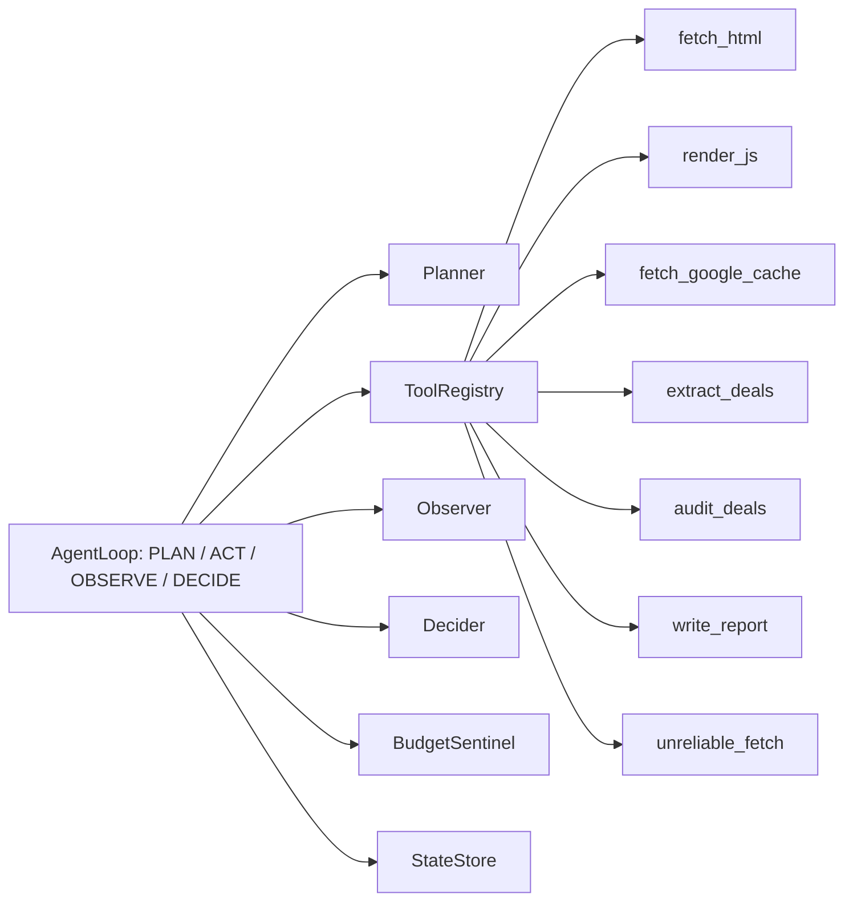

# GrabOn Merchant Deal Audit Agent

Submission for **Assignment 02: The Loop**.

I built a single-agent merchant audit workflow for 20 GrabOn merchants. For each merchant, the agent fetches or renders the deal page, extracts current offers, compares them against a mock GrabOn database, classifies deals as `Fresh`, `Stale`, `Missing`, or `Updated`, and writes a structured audit report.

I chose this assignment because it is a compact way to show the parts that matter in an agentic backend: a visible loop, typed tools, recovery, budgets, state, logs, and evals. It is not just a scraper; the interesting part is how the agent keeps moving when a provider, page, or tool fails.

## Architecture


The main loop lives in `agent/loop.py`. It exposes the required phases directly as `plan()`, `act()`, `observe()`, and `decide()`. Each iteration is logged with phase, action, tool, observation, decision, tokens, and wall-clock time.

## Design Choices
- `agent/`: keeps orchestration explicit instead of hiding the loop behind a framework. This is more code, but easier to explain and debug.
- `tools/`: all tools use typed schemas, timeout metadata, cost annotations, and structured errors through `tools/base.py`.
- `recovery/`: separates error classification from fallback strategy. A `429` is retried, a `403_CF` replans to another fetch tool, and a `404` becomes impossible.
- `observability/`: terminal dashboard plus JSON/JSONL artifacts in `outputs/`. LangSmith tracing is optional for hosted inspection.
- `eval/`: scenario-driven tests run the real loop and assert status, halt reason, tool path, and reasoning snippets.

Provider behavior is intentionally guarded: Groq/Gemini can be tried first, but deterministic code validates or backs up loop control so the agent does not loop forever on bad model output.

## Tools
The repo has 7 custom tools:
- `fetch_html`
- `render_js`
- `fetch_google_cache`
- `extract_deals`
- `audit_deals`
- `write_report`
- `unreliable_fetch`

`unreliable_fetch` exists to test recovery. The normal acquisition fallback chain is:

```text
fetch_html -> render_js -> fetch_google_cache
```

## Run It
Prerequisite: Python `3.10+`.

Windows:
```powershell
python -m venv .venv
.venv\Scripts\activate
pip install -r requirements.txt
python main.py
```

macOS / Ubuntu:
```bash
python -m venv .venv
source .venv/bin/activate
pip install -r requirements.txt
python main.py
```

Environment variables:
```env
GROQ_API_KEY=
GROQ_PLAN_MODEL=llama-3.3-70b-versatile
GROQ_EXTRACT_MODEL=llama-3.1-8b-instant
GEMINI_API_KEY=
GEMINI_REPORT_MODEL=gemini-2.0-flash
ERROR_MODEL_PROVIDER=groq
ERROR_MODEL_NAME=llama-3.1-8b-instant
PROVIDER_TIMEOUT_SECONDS=4
LANGSMITH_API_KEY=
LANGSMITH_TRACING=true
LANGSMITH_TRACING_V2=true
LANGSMITH_PROJECT=grabon-loop
```

Get API keys:
- Groq: [https://console.groq.com/keys](https://console.groq.com/keys)
- Gemini: [https://aistudio.google.com/api-keys](https://aistudio.google.com/api-keys)
- LangSmith: [https://smith.langchain.com/settings](https://smith.langchain.com/settings)

Live providers in the main demo:
- Groq: loop reasoning and extraction
- Gemini: report generation

If provider calls fail, the agent falls back to deterministic planning, parsing, or report templates.

## Logs And Traces
Every run writes:
- `outputs/audit_report.json`
- `outputs/iterations.jsonl`
- `outputs/tool_history.jsonl`
- `outputs/token_curve.jsonl`
- `outputs/merchant_states.json`
- `outputs/provider_calls.json`

Useful local checks:
```powershell
Get-ChildItem outputs
Get-Content outputs\iterations.jsonl
Get-Content outputs\tool_history.jsonl
Get-Content outputs\provider_calls.json
```

 Open [LangSmith](https://smith.langchain.com/), select project `grabon-loop`, and inspect the latest root trace named `grabon_main`.

Fallback spans to search:
- `provider_fallback:*`
- `fallback:*`
- `recovery:*`

If the LangSmith UI is filtered to `LLM Calls`, remove that filter to see deterministic fallback spans.

## Evals
Run the full eval suite:
```bash
python -c "from pathlib import Path; from eval.runner import EvalRunner; from eval.report import write_eval_reports; root=Path('.'); results=EvalRunner(root, root/'eval'/'scenarios').run_all(); write_eval_reports(results, root/'outputs'); print([(r.name, r.passed) for r in results])"
```

Latest result:
- scenarios: `13`
- pass rate: `13 / 13`
- recovery scenarios: `3 / 3`
- budget scenarios: `2 / 2`
- impossible scenarios: `2 / 2`
- deterministic eval provider cost: `0`
- measured eval latency: about `1.23s`

Raw eval output:
- `outputs/eval_report.json`
- `outputs/eval_report.txt`

Useful single scenarios:
```bash
python -c "from pathlib import Path; from eval.runner import EvalRunner; root=Path('.'); r=EvalRunner(root, root/'eval'/'scenarios').run_scenario(root/'eval'/'scenarios'/'failure_recovery_1.yaml'); print('passed=', r.passed); print(r.actual)"
```

```bash
python -c "from pathlib import Path; from eval.runner import EvalRunner; root=Path('.'); r=EvalRunner(root, root/'eval'/'scenarios').run_scenario(root/'eval'/'scenarios'/'budget_exceeded_1.yaml'); print('passed=', r.passed); print(r.actual)"
```

## Cost And Latency
Latest measured live-agent run from local artifacts:
- Groq provider calls recorded: `328`
- Groq tokens recorded: `141,966`
- Groq breakdown: `80` plan, `80` act, `80` observe, `68` decide, `20` extract
- tool calls: `80`
- agent token counter: `4,790`

Gemini quota/cost should be checked in the Gemini dashboard because quota-limited or failed calls may not appear cleanly in `outputs/provider_calls.json`.

For final cost reporting I use:
- `outputs/provider_calls.json` for local provider-call counts
- Groq dashboard for Groq token/cost numbers
- Gemini dashboard for Gemini token/cost numbers
- LangSmith traces for call-level evidence and fallback explanation

## What Broke First
The first real bug was trust in the eval harness.

Early evals looked correct but did not prove that the real loop recovered. The fix was to run the actual `AgentLoop` inside eval scenarios and assert real outcomes: final status, halt reason, tool path, and reasoning snippets.

A later issue came from making provider reasoning first in `PLAN`, `ACT`, `OBSERVE`, and `DECIDE`. The model could choose valid-looking but wrong transitions, which caused long loops. The fix was provider-first with deterministic validation: the provider can propose, but the state machine protects correctness.

## What I Would Change With 2 More Weeks
- add a dedicated live crawling mode with real HTTP/JS acquisition
- add a small live-provider eval subset alongside deterministic scenarios
- aggregate provider dashboard costs into `outputs/cost_summary.json`
- reduce provider-first loop latency without weakening validation
- add more merchant-specific extraction edge cases

## Known Gaps
The project is strongest on loop clarity, recovery, typed tools, budget control, observability, and reproducible evals.

It is weaker on always-live crawling and live-provider evals. That tradeoff is deliberate for this submission: the repo is optimized to make the loop and recovery behavior easy to inspect under review.
